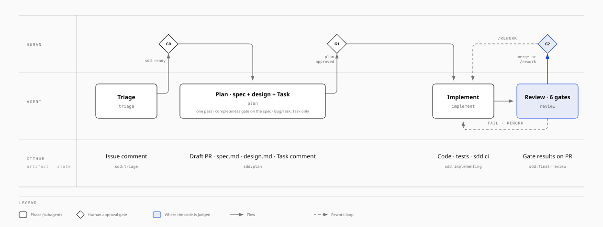

# sdd-factory

A **Spec-Driven Development** framework for coding agents, packaged as agent skills: typed GitHub issues, triage, spec → design → task with human approval gates, implementation, six adversarial Review Gates with bounded rework, and a single rule file per project (`docs/constitution.md`).

It runs in Claude Code as a plugin and in any other agent that reads `SKILL.md` files (Codex, Cursor, Gemini CLI, …): the skills are plain Markdown, the tooling is one bash CLI (`bin/sdd`) over `gh`, and the one subagent (`reviewer`) is an optimization the skills fall back from when the host has none.

## Requirements

- `gh` authenticated, `jq`, `git`, bash.
- The repository belongs to a **GitHub organization** (native Issue Types are organization-level). Creating the `Change` and `Constitution` types needs `gh auth refresh -h github.com -s admin:org` once.

## Install

**Claude Code**, development:

```bash
cd <your-repo>
claude --plugin-dir /path/to/sdd-factory
```

stable:

```bash
claude plugin marketplace add GoKaju/sdd-factory
claude plugin install sdd-factory@sdd-factory
```

and for every collaborator, in the project's `.claude/settings.json`:

```json
{
  "extraKnownMarketplaces": { "sdd-factory": { "source": { "source": "github", "repo": "GoKaju/sdd-factory" } } },
  "enabledPlugins": { "sdd-factory@sdd-factory": true }
}
```

**Any other agent:** clone this repository, put `bin/` on the PATH (`export PATH="/path/to/sdd-factory/bin:$PATH"`), and point the host at `skills/` (each `skills/<name>/SKILL.md` follows the Agent Skills format; copy or symlink them where your host discovers skills). The `/sdd-init` skill writes an `AGENTS.md` that lists the skills, so a host with no skill system can still be told "follow skills/sdd-triage/SKILL.md for issue 12".

## Flow



`/sdd-init` runs once per repository (constitution, `CLAUDE.md`, `AGENTS.md`, labels, Issue Types, issue forms). After that every issue moves left to right: the agent runs a skill, leaves an artifact and a state label on GitHub, and a human approves at the gate before the next skill may run. Review runs the six gates over one review pack; on PASS the PR is marked ready and the human merges (Gate 4) or comments `/rework` with one bullet per change, which `/sdd-implement` turns into Task steps. On FAIL the issue loops back to implement, at most the constitution's Rework budget. Source: `docs/sdd-flow.html`.

The issue type decides the path: **Feature** and **Change** take every step; **Bug**, **Task** and **Constitution** go from `ready` straight to `/sdd-task`. A Bug or Task whose root cause is in the spec or design is stopped and reclassified as Change.

## Where things live

| Place | Holds |
| --- | --- |
| Issue | intent, triage comment, Task comment with checklist, `sdd:<state>` label |
| Draft PR | `spec.md`, `design.md`, ADRs, code, gate results as comments |
| `docs/` on `main` | approved, merged truth: `docs/<domain>/<module>/{spec,design}.md` (the current state of the module, never its history: git is the history) and `docs/adrs/NNNN-*.md` (one immutable file per decision; reversals supersede) |
| `docs/constitution.md` | the only rule file: Identity, Rules (one line each, stable IDs), Decisions, Commands (what `sdd ci` runs), Verification (gates, rework budget). `CLAUDE.md` and `AGENTS.md` just point to it |

## Layout

```
.claude-plugin/   plugin.json, marketplace.json
bin/sdd           the one CLI the skills call: sdd state|type|org-types|comment|pr|gate-result|review-pack|rework|flag|ci, sdd lang, sdd rework-budget
scripts/          the bash behind each sdd command (gh + jq + git)
skills/           sdd-init, sdd-triage, sdd-spec, sdd-design, sdd-task, sdd-implement, sdd-review, sdd-status
gates/            one checklist per Review Gate (completeness, spec-compliance, test-strategy, design-architecture, code-quality, security, regression, docs) + README with the common rules
agents/           reviewer — the only subagent; runs any set of gates over the review pack, fresh context
hooks/            Claude Code PreToolUse hooks: protect docs/constitution.md and approved spec/design/ADRs; deny push to main, force-push, history rewrites
templates/        constitution, commits, spec, design, adr, gate-result, comments/{en,es}, issue-forms/{en,es}, examples/constitution.ddd-ts.md
```

## Design choices

- **Stack-agnostic.** The constitution template ships only the workflow rules; every architecture, domain, test and code rule is written by the project (or copied from `templates/examples/`). The gates check the constitution's rules as written and skip what it does not state. Nothing in the framework names a folder layout, a language or a package manager.
- **One reviewer.** The six gates are checklists in `gates/`; the `reviewer` agent runs the requested set over one review pack in one reading with independent verdicts. Hosts without subagents run the same checklists inline. Deterministic checks are a script (`sdd ci`), not an agent; committing follows `templates/commits.md`, not an agent.
- **Documents are the current truth.** Spec and design never carry history; decisions are ADRs; deltas live in the PR description; drift is fixed in code, never by editing the document.
- **Humans hold the gates.** No skill ever sets `sdd:ready` or an `*-approved` label, merges, or edits an approved document in passing.

## Guarantees

In Claude Code, hooks enforce: `docs/constitution.md` changes only during a Constitution-type issue; approved `spec.md`, `design.md` and ADRs cannot be edited while their issue is in implementation or review; no `git push` to `main`, no force-push, no rebase / amend / reset --hard. In other hosts the same rules are stated in every skill and backed by the branch protection `/sdd-init` recommends.

## Adding a gate

Write `gates/<name>.md` (question, procedure, checklist with severities, output schema), list it in the constitution's Verification, and name it in the `gates:` input of the reviewer or in `/sdd-review`. `sdd gate-result aggregate` treats every posted result the same way.

## Orca

The repository is also an [Orca](https://www.onorca.dev) plugin marketplace. In Orca: Settings → Plugins (enable the plugin system) → Marketplaces → add the git source `https://github.com/GoKaju/sdd-factory.git`, then install **SDD Factory** (`gokaju.sdd-factory`, manifest `orca-plugin.json`). It contributes a **panel** that types `/sdd-<phase> <issue>` into the terminal of the focused worktree you choose; that terminal must run an agent with this plugin's skills loaded.

Orca plugins cannot ship agent skills yet, so the skills, gates and hooks stay agent skills: install the plugin in Claude Code as above, or pull single skills with `npx skills add https://github.com/GoKaju/sdd-factory --skill sdd-triage` (every `skills/<name>/SKILL.md` is a valid Orca skill source). Approvals never go through Orca: they stay labels on the issue and `/rework` comments on the PR.

## Orchestration

The framework decides mechanically; an orchestrator only chooses when, how many and where. Two pieces ship here:

- **`sdd next [--all]`** — one JSON line per open issue with the verdict of the state machine: `run` (a phase to launch), `approve` (a gate the constitution delegates, to verify first), `human`, `busy`. Exit code 1 when nothing is runnable, so it doubles as a free precheck.
- **`/sdd-orchestrate`** — the coordinator skill for [Orca](https://www.onorca.dev): reads `sdd next`, grants delegated gates only after verifying the artifact (and, for `(judged)` gates, after the `reviewer` agent passes it), launches each runnable phase as a supervised Orca worker in the issue's own worktree, waits for `worker_done`, and reports. Scheduled with an Orca automation whose `--precheck` is `sdd next`, so idle ticks cost nothing.

Delegation is a constitution line — `- **Delegated gates:** Intake, Spec (judged), Task` — and a Constitution issue is never merged by a machine. Any other orchestrator (a poller, a control plane) consumes the same commands, labels, comments and gate results.
